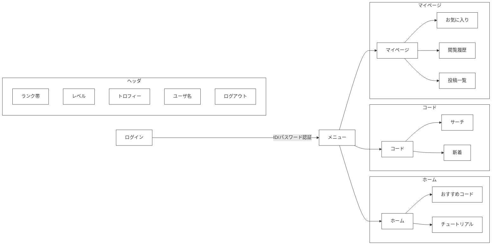

```mermaid
    graph LR

  classDef default fill: #fff,stroke: #333,stroke-width: 1px;
  style funcA fill: #fff,stroke: #333,stroke-width: 1px;
  style funcB fill: #fff,stroke: #333,stroke-width: 1px;
  style funcC fill: #fff,stroke: #333,stroke-width: 1px;
  style header fill: #fff,stroke: #333,stroke-width: 1px;

  ログイン--ID/パスワード認証-->メニュー

  メニュー-->ホーム
  メニュー-->コード
  メニュー-->マイページ

  subgraph funcA [ホーム]
    ホーム-->おすすめコード
    ホーム-->チュートリアル
  end

  subgraph funcB [コード]
    コード-->サーチ
    コード-->新着
  end

  subgraph funcC [マイページ]
    マイページ-->お気に入り
    マイページ-->閲覧履歴
    マイページ-->投稿一覧
  end

  subgraph header [ヘッダ]
    ランク帯
    レベル
    トロフィー
    ユーザ名
    ログアウト
  end
```