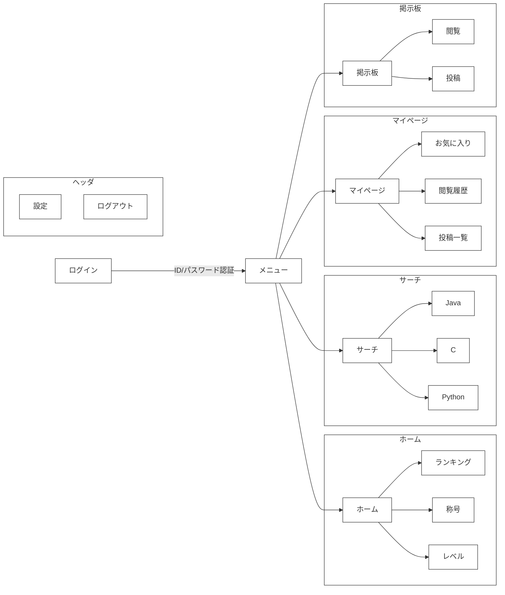

```mermaid
    graph LR

  classDef default fill: #fff,stroke: #333,stroke-width: 1px;
  style funcA fill: #fff,stroke: #333,stroke-width: 1px;
  style funcB fill: #fff,stroke: #333,stroke-width: 1px;
  style funcC fill: #fff,stroke: #333,stroke-width: 1px;
  style funcD fill: #fff,stroke: #333,stroke-width: 1px;
  style header fill: #fff,stroke: #333,stroke-width: 1px;

  ログイン--ID/パスワード認証-->メニュー

  メニュー-->ホーム
  メニュー-->サーチ
  メニュー-->マイページ
  メニュー-->掲示板

  subgraph funcA [ホーム]
    ホーム-->ランキング
    ホーム-->称号
    ホーム-->レベル
  end

  subgraph funcB [サーチ]
    サーチ-->Java
    サーチ-->C
    サーチ-->Python
  end

  subgraph funcC [マイページ]
    マイページ-->お気に入り
    マイページ-->閲覧履歴
    マイページ-->投稿一覧
  end

  subgraph funcD [掲示板]
    掲示板-->閲覧
    掲示板-->投稿
  end

  subgraph header [ヘッダ]
    設定
    ログアウト
  end
```