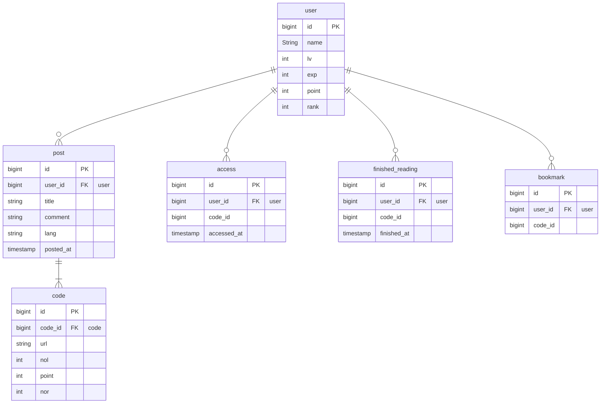

```mermaid　
erDiagram
    user {
        bigint id PK
        String name
        int lv
        int exp
        int point
        int rank
    }

    post {
        bigint id PK
        bigint user_id FK "user"
        string title
        string comment
        string lang
        timestamp posted_at
    }

    code {
        bigint id PK
        bigint code_id FK "code"
        string url
        int nol
        int point
        int nor
    }

    access {
        bigint id PK
        bigint user_id FK "user"
        bigint code_id
        timestamp accessed_at
    }

    finished_reading {
        bigint id PK
        bigint user_id FK "user"
        bigint code_id
        timestamp finished_at
    }

    bookmark {
        bigint id PK
        bigint user_id FK "user"
        bigint code_id
    }

    user ||--o{ post : ""
    user ||--o{ access : ""
    user ||--o{ finished_reading : ""
    user ||--o{ bookmark : ""
    post ||--|{ code : ""
```